# Financial Document Extractor Control Flow

This flowchart visualizes the control flow of the Financial Document Extractor (v0.1.3), showing how the system processes PDF documents using multiple extraction strategies.

```mermaid
flowchart TD
    Start([Start: main]) --> Init[Initialize FinancialDocumentExtractor<br/>with API key, attributes file, use_vision flag]
    Init --> LoadAttrs[_load_attributes<br/>Load 24 financial attributes from file]
    LoadAttrs --> ProcessDir{Process directory<br/>or single file?}

    ProcessDir -->|Directory| FindPDFs[process_directory<br/>Find all PDF files in directory]
    ProcessDir -->|Single File| ProcessPDF[process_pdf_file]
    FindPDFs --> ProcessPDF

    ProcessPDF --> OpenPDF[Open PDF with PyMuPDF]
    OpenPDF --> PageLoop{More pages<br/>to process?}

    PageLoop -->|Yes| CheckStrategy{force_vision OR<br/>use_vision enabled?}
    PageLoop -->|No| ClosePDF[Close PDF document]

    CheckStrategy -->|Yes - Vision Mode| VisionAPI[_process_page_with_vision]
    CheckStrategy -->|No - Text Mode| ExtractText[_extract_text_from_pdf_page<br/>Extract text using PyMuPDF]

    VisionAPI --> ConvertImg[_pdf_page_to_base64_image<br/>Convert page to PNG, encode base64]
    ConvertImg --> CheckSize{Image size<br/>> 20MB?}
    CheckSize -->|Yes| ReduceDPI[Reduce DPI by 30%<br/>and retry]
    ReduceDPI --> ConvertImg
    CheckSize -->|No| CreateVisionPrompt[_create_vision_extraction_prompt<br/>Build XML-structured prompt]

    CreateVisionPrompt --> CallVision[_call_openai_vision_api<br/>Send to GPT-4o with high detail]
    CallVision --> VisionSuccess{Vision API<br/>successful?}

    VisionSuccess -->|Yes| ProcessResponse[_process_llm_response<br/>Parse XML response]
    VisionSuccess -->|No & not forced| ExtractText
    VisionSuccess -->|No & forced| LogVisionError[Log vision_processing_error exception]

    ExtractText --> CheckText{Text content<br/>>= 50 chars?}
    CheckText -->|Yes| ChunkText[_chunk_text<br/>Split into 3000 char chunks with overlap]
    CheckText -->|No| TryOCR[_ocr_pdf_page<br/>Initialize EasyOCR if needed]

    TryOCR --> OCRConvert[Convert page to image<br/>with 2x resolution]
    OCRConvert --> RunOCR[Run EasyOCR.readtext<br/>Filter confidence > 0.5]
    RunOCR --> CheckOCR{OCR text<br/>extracted?}

    CheckOCR -->|Yes| ChunkText
    CheckOCR -->|No| LogNoText[Log warning: No text extracted]
    LogNoText --> PageLoop

    ChunkText --> ChunkLoop{More chunks<br/>to process?}
    ChunkLoop -->|Yes| CreateTextPrompt[_create_extraction_prompt<br/>Build XML-structured prompt with chunk]
    ChunkLoop -->|No| PageLoop

    CreateTextPrompt --> CallTextAPI[_call_openai_text_api<br/>Send to GPT-4]
    CallTextAPI --> ProcessResponse

    ProcessResponse --> ParseExtractions[Extract all &lt;extraction&gt; tags<br/>using regex]
    ParseExtractions --> ParseExceptions[Extract all &lt;exception&gt; tags<br/>using regex]

    ParseExceptions --> SaveExtractions[Save ExtractedInfo objects<br/>with filename, page, field_label,<br/>field_value, confidence, method]
    SaveExtractions --> SaveExceptions[Save ExceptionLog objects<br/>with issue_type, description, timestamp]
    SaveExceptions --> ChunkLoop

    LogVisionError --> PageLoop

    ClosePDF --> MoreFiles{More PDF files<br/>to process?}
    MoreFiles -->|Yes| ProcessPDF
    MoreFiles -->|No| ExportResults[export_results<br/>Write JSON files]

    ExportResults --> ExportData[Export extracted_financial_data.json<br/>with all field extractions]
    ExportData --> ExportExc[Export extraction_exceptions.json<br/>with all logged issues]

    ExportExc --> GetStats[get_summary_statistics<br/>Calculate totals, field counts,<br/>confidence distribution, methods]
    GetStats --> PrintSummary[Print summary statistics<br/>to console]
    PrintSummary --> End([End])

    style Start fill:#90EE90
    style End fill:#FFB6C1
    style VisionAPI fill:#87CEEB
    style CallVision fill:#87CEEB
    style CallTextAPI fill:#FFE4B5
    style TryOCR fill:#DDA0DD
    style ProcessResponse fill:#F0E68C
    style ExportResults fill:#98FB98
```

## Flow Summary

### Main Processing Flow
1. **Initialization** - Load OpenAI API, attributes file, and configure vision settings
2. **PDF Processing** - Handle directory or single file processing
3. **Page-by-Page Processing** - Loop through all pages in each PDF

### Dual Extraction Strategy

#### Vision Mode (Blue)
- Uses GPT-4o Vision API with base64-encoded images
- Handles DPI reduction for oversized images (>20MB)
- Falls back to text extraction if vision fails (unless forced)

#### Text Mode (Yellow)
- Traditional text extraction with PyMuPDF
- Falls back to EasyOCR (Purple) when text is insufficient (<50 chars)
- Chunks large text into 3000-character segments with 200-character overlap

### Response Processing
- Parses XML-structured responses using regex
- Extracts `<extraction>` tags into structured data
- Extracts `<exception>` tags for error logging
- Converts confidence levels (high/medium/low) to numeric values (0.9/0.7/0.5)

### Export & Statistics
- Exports extracted data and exceptions to JSON files
- Generates summary statistics including:
  - Total extractions and exceptions
  - Confidence distribution
  - Extraction methods used
  - Field-by-field breakdown

## Color Legend
- **Green**: Start/End points and export operations
- **Blue**: Vision API processing path
- **Yellow**: Text-based LLM processing
- **Purple**: OCR processing
- **Light Yellow**: Common response processing
